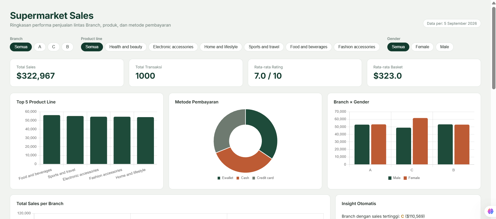

# Supermarket Sales Dashboard

An interactive sales dashboard built entirely with **Google Sheets + Google Apps Script** — from raw data cleaning to a live, filterable web dashboard with auto-generated insights.

🔗 **Live Demo:** [Open Dashboard](https://script.google.com/macros/s/AKfycbzO3Zs3HRUCnFrxHocTx9vHZLOnCoGn1oFE5xzpc3Rq0yXAOMvXxqkGzU37Jjq-ZVnK/exec)
📄 **View-only Spreadsheet:** [Open Sheet](https://docs.google.com/spreadsheets/d/1uHhDcKDHSEriOVc3S29P-vNXGktcHmFQPPlmKo8apUM/edit?usp=sharing)



## Overview

This project analyzes ~1,000 retail transactions to answer common retail questions: Which branch performs best? Which product line sells the most? What payment methods do customers prefer? The project has two layers:

1. **A manual analysis layer in Google Sheets** — Pivot Tables and formulas used to explore the data and validate results.
2. **A live interactive Web App** — built with Google Apps Script (`HtmlService`), reading directly from the spreadsheet, with filters, charts, and auto-generated insight text.

## Features

- **Live filtering** by Branch, Product line, and Gender — every chart, KPI, and insight recalculates instantly
- **KPI cards**: Total Sales, Total Transactions, Average Rating, Average Basket Size
- **Auto-generated insights** — plain-language takeaways (top branch, best-selling category, preferred payment method) computed from the currently filtered data, not hardcoded
- **5 chart types**: bar, grouped bar, doughnut, and line charts (Chart.js)
- **Searchable transaction table**
- **Custom Sheets menu** (`Dashboard Tools → Refresh Dashboard`) for one-click refresh of the underlying pivot data

## Tech Stack

| Layer | Tool |
|---|---|
| Data storage | Google Sheets |
| Backend logic | Google Apps Script (JavaScript) |
| Frontend | HTML, CSS, vanilla JavaScript |
| Charts | Chart.js |
| Deployment | Apps Script Web App |

## Project Structure

```
supermarket-sales-dashboard/
├── data/
│   └── Supermarket_Sales_Cleaned.csv   # source dataset
├── apps-script/
│   ├── Code.gs                          # server-side: reads Raw_Data, serves the web app
│   └── Dashboard.html                   # client-side: filtering, charts, insights
└── screenshots/
```

## How It Works

- `Code.gs` has one job: read every row from the `Raw_Data` sheet and return it as a clean array of transaction objects (`{ branch, product, total, rating, ... }`). No aggregation happens on the server side.
- `Dashboard.html` receives that array once via `google.script.run`, then does **all filtering and aggregation client-side** in JavaScript. This means applying a filter is instant — no round-trip to the spreadsheet needed after the initial load.
- Insight sentences (e.g. *"Branch with highest sales: C"*) are generated by sorting the filtered data on the fly, not written as static text.

## Data Source

[Supermarket Sales dataset](https://www.kaggle.com/datasets/aungpyaeap/supermarket-sales) (Kaggle) — used here for portfolio/learning purposes.

## Lessons Learned

- Spreadsheet **locale settings matter**: importing a US-formatted CSV (period as decimal separator) into a sheet set to Indonesian locale silently misparsed every decimal column — a good reminder to check locale before trusting an import.
- Keeping the "data layer" (`Code.gs`) and "presentation/analysis layer" (`Dashboard.html`) separate made debugging much easier — most bugs during development were isolated to one side or the other.

## Setup (to run your own copy)

1. Create a Google Sheet and import `data/Supermarket_Sales_Cleaned.csv` into a sheet named `Raw_Data` (make sure your spreadsheet locale matches the CSV's number format).
2. Open **Extensions → Apps Script**, paste `Code.gs` and `Dashboard.html` into the editor.
3. Run `onOpen` once to authorize the script.
4. **Deploy → New deployment → Web app** to get your live dashboard URL.

## Author

**Raissa Undita Estiningtyas**
Mathematics student, Institut Teknologi Sepuluh Nopember (ITS)
